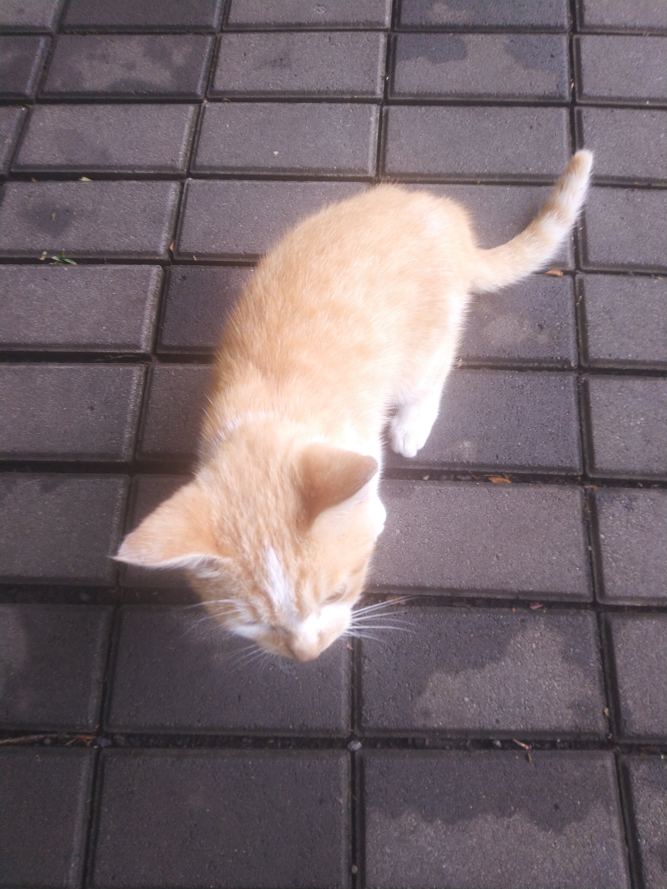
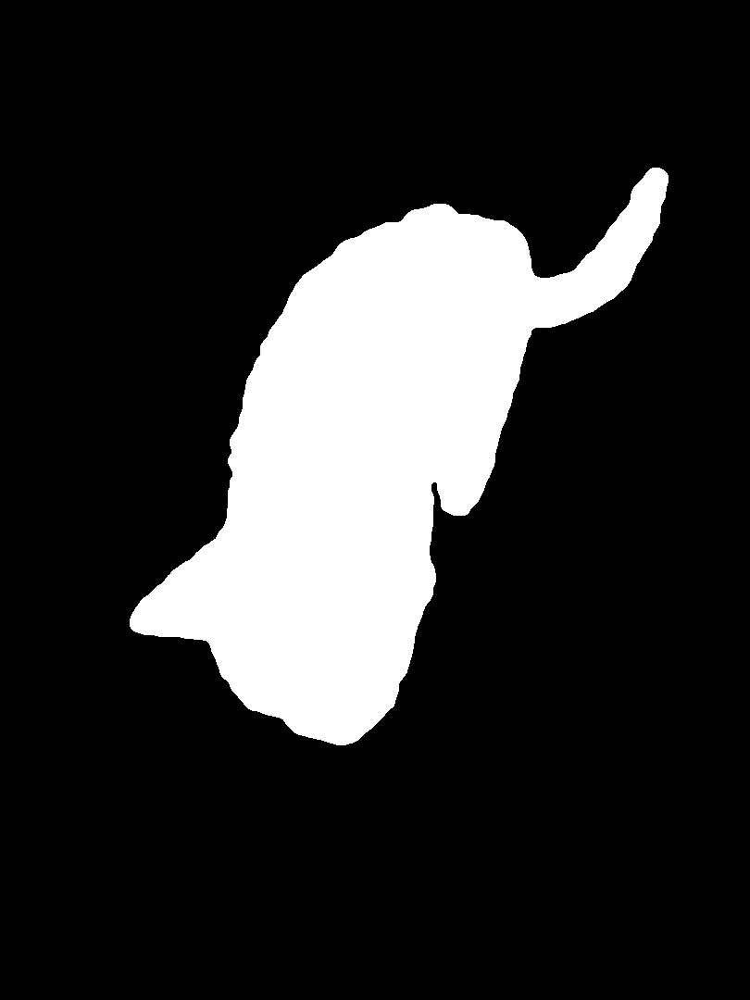
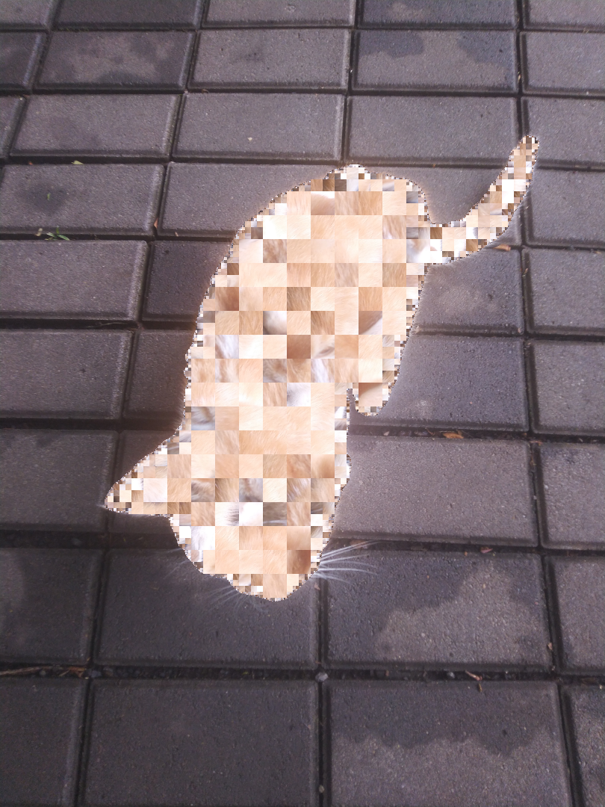

# Jigshuffle

Shuffle images semi-nondestructively.

Using an image (and optional mask), shuffles it such that:
* No element is duplicated nor removed.
* All elements in a block is moved together.
* All blocks occupies it's maximum size that satisfies mask
  and power-of-2 coordinate.

This can be used to create interesting shuffle/censor, where
all the data is preserved, while being not very obvious.

## Example

Original:  


Mask:  


Output (using seed `C12AF7ED`):  


## Using

You can embed it to your application/library, or use included binary form.
To build it, use `cargo build --release` on cloned repository.

Help/manual:
```
$ target/release/jigshuffle --help
Usage: jigshuffle [OPTIONS] --tile-size <TILE_SIZE> --output <OUTPUT> <INPUT>

Arguments:
  <INPUT>  Input file

Options:
  -m, --mask <MASK>            Mask file
  -t, --tile-size <TILE_SIZE>  Tile size (must be power of 2)
  -r, --rotate                 Rotate blocks randomly
  -f, --flip                   Flip blocks randomly
      --seed <SEED>            Random seed
  -o, --output <OUTPUT>        Output file
  -h, --help                   Print help
  -V, --version                Print version
```

## License

This library is licensed with GNU General Public License version 3.
